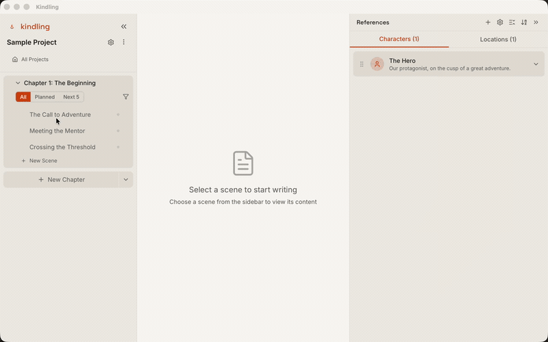

<p align="center">
  
</p>

<h1 align="center">Kindling</h1>

<p align="center">
  <strong>Free, open-source writing software for plotters and outliners.</strong><br/>
  Bridge the gap between your story outline and your first draft.
</p>

<p align="center">
  <a href="https://kindlingwriter.com/">Website</a> ·
  <a href="https://kindlingwriter.com/download/">Download</a> ·
  <a href="https://kindlingwriter.com/features/">Features</a> ·
  <a href="https://kindlingwriter.com/docs/">Docs</a> ·
  <a href="https://kindlingwriter.com/compare/">Compare</a> ·
  <a href="#contributing">Contributing</a>
</p>

<p align="center">
  <a href="https://github.com/smith-and-web/kindling/actions/workflows/ci.yml">
    
  </a>
  <a href="https://github.com/smith-and-web/kindling/releases">
    
  </a>
  <a href="https://github.com/smith-and-web/kindling/blob/main/LICENSE">
    
  </a>
  <a href="https://github.com/smith-and-web/kindling/stargazers">
    
  </a>
  <a href="https://github.com/smith-and-web/kindling/releases">
    
  </a>
  
</p>

---

<p align="center">
  
</p>

> **New in v1.2:** Light theme, full-page prose editing, bidirectional Scrivener import/export, screenplay project type, custom fields & tags, smart reference detection, and story structure templates. [Read the release notes.](https://github.com/smith-and-web/kindling/releases/tag/v1.2.0)

## Why Kindling?

- **Your outline stays visible while you write.** Scene beats appear as expandable prompts in your drafting space. No more switching between apps.
- **Import your existing work.** Bring in projects from Scrivener (.scriv), Plottr (.pltr), yWriter (.yw7), Obsidian Longform, or Markdown — no starting from scratch.
- **No AI. No subscription. No cloud.** Every word is yours. Your projects are local SQLite files. Works completely offline.
- **Free and open source.** MIT licensed. Inspect the code, contribute, or fork it. Your tools should be as permanent as your writing.

## Download

Get Kindling for free at **[kindlingwriter.com/download](https://kindlingwriter.com/download/)**

| Platform | Download |
|----------|----------|
| macOS (Universal) | `Kindling_*_universal.dmg` |
| Windows | `Kindling_*_x64-setup.msi` |
| Linux | `Kindling_*_amd64.AppImage` or `.deb` |

Or grab the latest directly from the [Releases page](https://github.com/smith-and-web/kindling/releases).

## Features

| Feature | Description |
|---------|-------------|
| **Import from popular tools** | Scrivener 3 (`.scriv`), Plottr (`.pltr`), Markdown (`.md`), yWriter (`.yw7`), and Longform/Obsidian |
| **Scaffolded writing view** | Scene beats appear as expandable prompts — or switch to full-page prose editing |
| **Rich text prose editor** | Write with formatting, auto-save, word count, and beat context |
| **Export formats** | Scrivener (`.scriv`), DOCX (Standard Manuscript Format), EPUB, Markdown, Longform/Obsidian, and Treatment (1-page & 5-page) |
| **Screenplay support** | Screenplay project type with sluglines, acts/sequences, and page count estimates |
| **Reference auto-detection** | Characters and locations are auto-detected in your prose — no manual linking needed |
| **Custom fields & tags** | Add typed custom fields (text, number, select, etc.) and hierarchical tags to any entity |
| **Beat sheet templates** | Start from Hero's Journey, Save the Cat, Three-Act Structure, Story Circle, and more |
| **Reference panel** | Characters, locations, items, objectives, and organizations — linked per scene |
| **Sync/reimport** | Preview and apply source changes while preserving your prose |
| **Light & dark themes** | System preference detection with manual override |
| **Local-first** | Your work stays on your machine in a SQLite database |
| **Cross-platform** | macOS, Windows, and Linux |

See the full [features overview](https://kindlingwriter.com/features/) on the website.

## Tech Stack

- **Frontend**: [Svelte 5](https://svelte.dev/) + [Tailwind CSS](https://tailwindcss.com/)
- **Backend**: [Rust](https://www.rust-lang.org/) + [Tauri 2.x](https://tauri.app/)
- **Database**: [SQLite](https://sqlite.org/) via rusqlite
- **Parsers**: Native Rust parsers for Scrivener 3, Plottr, yWriter, Longform, and Markdown

## From Source

**Prerequisites:**
- [Node.js](https://nodejs.org/) 20+
- [Rust](https://rustup.rs/) (stable)
- Platform dependencies: [Tauri prerequisites](https://tauri.app/start/prerequisites/)

```bash
# Clone the repository
git clone https://github.com/smith-and-web/kindling.git
cd kindling

# Install dependencies
npm install

# Run in development mode
npm run tauri dev

# Build for production
npm run tauri build
```

## Roadmap

Track progress on the [project board](https://github.com/users/smith-and-web/projects/1).

| Phase | Status | Description |
|-------|--------|-------------|
| **v0.1 - Foundation** | ✅ Complete | Plottr import, basic UI, project structure |
| **v0.2 - Outline View** | ✅ Complete | Drag-and-drop reordering, create/delete scenes |
| **v0.3 - Writing & Export** | ✅ Complete | Prose editor, DOCX export with Standard Manuscript Format |
| **v1.0 - Release** | ✅ Complete | Additional importers, polish, performance, stability |
| **v1.1 - Plantser Support** | ✅ Complete | Rolling Outline Mode, blank projects, beat management, discovery notes, command palette, guided onboarding, auto-updater |
| **v1.2 - Features** | ✅ Complete | Scrivener import/export, screenplay support, light theme, custom fields, tags, templates, auto-detection, EPUB, treatments |

See the [milestones](https://github.com/smith-and-web/kindling/milestones) for detailed breakdowns.

## Testing

Kindling maintains high test coverage standards to ensure code quality and prevent regressions.

| Metric | Minimum | Current |
|--------|---------|---------|
| Statements | 95% | 100% |
| Branches | 65% | 100% |
| Functions | 98% | 100% |
| Lines | 95% | 100% |

**CI will fail if coverage drops below these thresholds.** New code must include appropriate tests.

```bash
# Frontend tests with coverage
npm test -- --coverage

# Rust tests
cd src-tauri && cargo test

# Run all checks (lint, format, types, tests)
npm run check:all
```

## Contributing

Contributions are welcome! Please read the [Contributing Guide](CONTRIBUTING.md) before submitting a PR.

- 🐛 [Report bugs](https://github.com/smith-and-web/kindling/issues/new?template=bug_report.yml)
- 💡 [Request features](https://github.com/smith-and-web/kindling/issues/new?template=feature_request.yml)
- 💬 [GitHub Discussions](https://github.com/smith-and-web/kindling/discussions) — Questions and ideas
- 🔥 [Discord](https://discord.gg/g7bkj4kY8w) — Chat with other writers and contributors

Looking for a place to start? Check out issues labeled [`good first issue`](https://github.com/smith-and-web/kindling/labels/good%20first%20issue).

## Support

If Kindling is useful to you, consider supporting its development:

<a href="https://github.com/sponsors/smith-and-web">
  
</a>

Your sponsorship helps keep Kindling free and open source.

## License

[MIT](LICENSE) — free for personal and commercial use.

## Acknowledgments

- Built with [Tauri](https://tauri.app/) and [Svelte](https://svelte.dev/)
- Inspired by [Scrivener](https://www.literatureandlatte.com/scrivener/) and [Plottr](https://plottr.com/)

---

<p align="center">
  Made with ☕ for writers who plan before they write.
</p>
