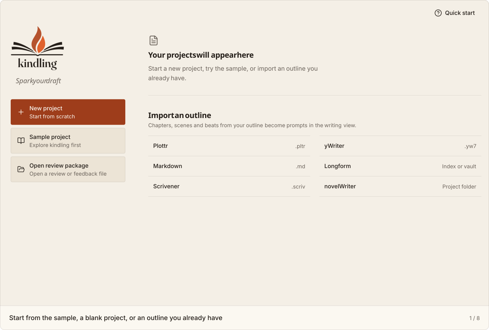

<p align="center">
  <picture>
    <source media="(prefers-color-scheme: dark)" srcset="static/brand/kindling-lockup-stacked-reversed.svg" />
    
  </picture>
</p>

<p align="center">
  <strong>Free, open-source writing software for plotters and outliners.</strong><br/>
  Bridge the gap between your story outline and your first draft.
</p>

<p align="center">
  <a href="https://kindlingwriter.com/">Website</a> ·
  <a href="https://kindlingwriter.com/download/">Download</a> ·
  <a href="https://kindlingwriter.com/features/">Features</a> ·
  <a href="https://kindlingwriter.com/docs/">Docs</a> ·
  <a href="https://kindlingwriter.com/compare/">Compare</a> ·
  <a href="#contributing">Contributing</a>
</p>

<p align="center">
  <a href="https://github.com/smith-and-web/kindling/actions/workflows/ci.yml">
    
  </a>
  <a href="https://github.com/smith-and-web/kindling/releases">
    
  </a>
  <a href="https://github.com/smith-and-web/kindling/blob/main/LICENSE">
    
  </a>
  <a href="https://github.com/smith-and-web/kindling/stargazers">
    
  </a>
  <a href="https://github.com/smith-and-web/kindling/releases">
    
  </a>
  
</p>

---

<p align="center">
  
</p>

<p align="center"><sub>A vector recording of the real app, captured through its local socket with <code>npm run demo:readme</code>.</sub></p>

## New in v1.3

- **A new look.** The whole app is rebuilt on [Press](#press-design-system), kindling's design system. It has paper-first light and dark themes, Inter controls, Fraunces headings and a Newsreader manuscript. In dark mode the manuscript stays on light paper.
- **Editorial review.** Add comments and tracked suggestions (insert, replace, delete), reply in threads, and accept or reject changes. You can hand an editor a `.kindling-review` package and read their `.kindling-feedback` back, all offline.
- **Scene revisions.** Save named drafts, compare any two, and restore one. Each scene can be marked First Draft, Editor Review, Revised or Final.
- **Find and replace** in a scene or across the whole project, with undo, match case and whole words.
- **Writing goals and statistics.** Set a daily word goal and see session totals, streaks and a per-chapter breakdown.
- **Previously.** The top of each scene shows the end of the scene before it.
- **Export workspace.** Save export profiles (_Agent submission_, _Writing group_, _Website chapters_ or your own) and see a live preview. HTML, plain text and single-file Markdown are new output formats.
- **novelWriter** import, export and prose sync.
- **Copy references** between projects.
- **Customizable keyboard shortcuts.**
- **One Settings window** for preferences and per-project details.
- **Remembers where you were.** Each project reopens at the scene, beat, cursor and scroll position where you left it.
- **A new sample project**, _The Letter_.
- **Reliability fixes** across sync, locking, imports and exports. See the [v1.3 triage](docs/release-triage-v1.3.md) for what is fixed now and what is scheduled for v1.3.1.

[All releases and notes →](https://github.com/smith-and-web/kindling/releases)

## Why kindling?

- **Your outline stays visible while you write.** Scene beats appear as expandable prompts in your drafting space, so you don't switch between apps.
- **Import your existing work.** Bring in Scrivener, Plottr, yWriter, novelWriter, Obsidian Longform or Markdown projects instead of starting from scratch.
- **No AI. No subscription. No account.** Every word is yours. Projects are local SQLite files, and writing, importing and exporting all work offline.
- **Free and open source.** kindling is MIT licensed. Inspect the code, contribute, or fork it. Your tools should be as permanent as your writing.

## Download

Get kindling for free at **[kindlingwriter.com/download](https://kindlingwriter.com/download/)**, or from the [Releases page](https://github.com/smith-and-web/kindling/releases).

| Platform          | File                                                                                                     |
| ----------------- | -------------------------------------------------------------------------------------------------------- |
| macOS (Universal) | `Kindling_<version>_universal.dmg`, signed and notarized                                                 |
| Windows (x64)     | `Kindling_<version>_x64-setup.exe` or `Kindling_<version>_x64_en-US.msi`                                 |
| Linux (x64)       | `Kindling_<version>_amd64.AppImage`, `Kindling_<version>_amd64.deb` or `Kindling-<version>-1.x86_64.rpm` |

Each release includes `checksums.sha256`. See [Installation](docs/installation.md) for per-platform steps and troubleshooting. Installed copies update themselves from GitHub Releases.

## Features

### Plan and import

| Feature                       | Description                                                                                                                                                                                      |
| ----------------------------- | ------------------------------------------------------------------------------------------------------------------------------------------------------------------------------------------------ |
| **Import from popular tools** | Plottr (`.pltr`), Scrivener 3 (`.scriv`), yWriter 7 (`.yw7`), novelWriter (project folder), Longform/Obsidian (index or vault) and Markdown (`.md`)                                              |
| **Sync and reimport**         | Preview source changes and apply them selectively while keeping your prose. Works for every import format except Scrivener. Locked chapters and scenes stay protected.                           |
| **Start fresh**               | Blank novel or screenplay projects, with story-structure templates: Save the Cat, Three-Act Structure, Hero's Journey, Story Circle and Seven-Point Story Structure. You can also save your own. |
| **Sample project**            | _The Letter_ is a short gothic mystery. It includes typed reference fields, tags, saved filters and a full set of editorial-review examples.                                                     |

### Write

| Feature                     | Description                                                                                                                                         |
| --------------------------- | --------------------------------------------------------------------------------------------------------------------------------------------------- |
| **Scaffolded writing view** | Beats appear as expandable prompts with prose beneath each one. You can switch to full-page prose editing at any time.                              |
| **Rich text editor**        | Formatting, auto-save and word counts. The manuscript is set on a paper sheet in Newsreader.                                                        |
| **Rolling outline**         | Scenes can be Fixed, Flexible or Undefined. Discovery notes, quick filters (_Planned_, _Next 5_) and a command palette (`Mod+K`) round it out.      |
| **Previously**              | The previous scene's title, synopsis and last three sentences, collapsible                                                                          |
| **Goals and statistics**    | Daily goal, streak, session totals and a per-chapter breakdown                                                                                      |
| **Find and replace**        | Scene or whole-project search with Replace all and Undo                                                                                             |
| **Screenplay support**      | Screenplay projects with sluglines, acts and sequences, page-count estimates, and on-page layout for cues, dialogue, parentheticals and transitions |
| **Where you left off**      | Each project reopens at the scene, beat, cursor and scroll position you left                                                                        |

### Revise and review

| Feature                 | Description                                                                                                                            |
| ----------------------- | -------------------------------------------------------------------------------------------------------------------------------------- |
| **Draft history**       | Named drafts per scene, with compare and restore                                                                                       |
| **Revision status**     | First Draft, Editor Review, Revised or Final, with a project-wide overview                                                             |
| **Editorial review**    | Comments, threaded replies and tracked insertions, deletions and replacements, which you accept or reject one at a time or all at once |
| **Review packages**     | Exchange `.kindling-review` and `.kindling-feedback` files with an editor. No server or account is involved.                           |
| **Snapshots and locks** | Project snapshots, plus locked scenes and chapters that edits, replacements and sync cannot change                                     |

### Organize

| Feature                      | Description                                                                             |
| ---------------------------- | --------------------------------------------------------------------------------------- |
| **Reference panel**          | Characters, locations, items, objectives and organizations, linked per scene            |
| **Reference auto-detection** | Characters and locations mentioned in your prose are suggested for linking              |
| **Copy between projects**    | Reuse reference entries across projects                                                 |
| **Custom fields and tags**   | Typed custom fields (text, number, select and more) and hierarchical tags on any entity |

### Export

| Feature              | Description                                                                                                                                                                             |
| -------------------- | --------------------------------------------------------------------------------------------------------------------------------------------------------------------------------------- |
| **Standard exports** | Word `.docx` (Standard Manuscript Format), ePub, Markdown, Longform, Scrivener (a new project or an update to an existing one), novelWriter, and one-page, five-page or full treatments |
| **Export workspace** | Reusable profiles with a live preview. Adds HTML, plain text and single-file Markdown output, and filename patterns such as `{title}`, `{profile}` and `{date}`.                        |

### App

| Feature                    | Description                                                           |
| -------------------------- | --------------------------------------------------------------------- |
| **Light, dark and system** | Press chrome in both themes; the manuscript stays light paper         |
| **Keyboard shortcuts**     | Rebind any command and see the changes immediately in menus and hints |
| **Local-first**            | One SQLite database on your machine                                   |
| **Cross-platform**         | macOS, Windows and Linux                                              |

See the full [features overview](https://kindlingwriter.com/features/) on the website.

## Privacy and network use

kindling has no analytics, telemetry, accounts or cloud sync, and your writing never leaves your computer unless you export it. It goes online in only two cases:

- **Updates.** Release builds check GitHub Releases shortly after launch and download an available update in the background. Nothing installs until you choose **Restart**.
- **Feedback you send.** **Help → Send Feedback…** posts your message, rating, app version, OS and locale, and only when you press **Send**.

Links in the About dialog open in your browser.

## Using kindling

### Keyboard shortcuts

`Mod` is Command on macOS and Ctrl on Windows and Linux. Here are some of the defaults:

| Shortcut      | Command               | Shortcut      | Command                      |
| ------------- | --------------------- | ------------- | ---------------------------- |
| `Mod+N`       | New project           | `Mod+K`       | Command palette              |
| `Mod+E`       | Export                | `Mod+,`       | Settings                     |
| `Mod+F`       | Find in scene         | `Mod+Shift+F` | Find and replace in project  |
| `Mod+Alt+V`   | Toggle beat/page view | `Mod+D`       | Toggle discovery notes       |
| `Mod+\`       | Toggle sidebar        | `Mod+Shift+R` | Toggle references panel      |
| `Mod+Shift+S` | Sync from source      | `Mod+O`       | Open review or feedback file |
| `Mod+Alt+M`   | Add editorial comment | `Mod+Shift+H` | Quick start guide            |

To customize them, open **Settings → kindling → Keyboard Shortcuts** and filter by command name. Select a binding, then press Command (macOS) or Ctrl (Windows/Linux) together with a letter, number, punctuation key or function key. Escape cancels recording; Tab moves on.

Changes apply immediately, update native menus and shortcut hints, and persist across launches. A conflicting or reserved combination is rejected with an explanation. To give an existing binding's keys to another command, clear the binding first. **Clear** disables a shortcut, and **Reset all to defaults** restores every binding. Standard text editing, system controls and dialog navigation keep their usual keys, including copy, paste, undo, Tab, Enter and Escape.

### Previous scene context

The **Previously** section at the top of a scene shows the preceding scene's title and synopsis. It also shows the last three sentences of that scene's prose, or all of it if the prose is shorter. It follows manuscript order across chapters, skips archived scenes and chapters, and reads whichever view is active, Beat or Page. Outline prompts are never treated as prose, and the first scene has no Previously section. You can collapse the section to save space; kindling remembers that choice across scenes and app restarts.

### Writing goals and statistics

**Counts**

- The sidebar shows saved word counts for the project, each chapter and each scene.
- The editor status bar shows totals for the current scene, chapter, project and session, even when the sidebar is collapsed.
- **Writing statistics** in the status bar shows:
  - total words
  - a chapter breakdown
  - how many scenes have prose and how many are empty
  - average words per scene, with empty scenes included
- Counts use the prose in the active Page or Beat view. Archived content and outline prompts are excluded.

**Daily goal**

- Set a **Daily writing goal** in **Settings → Project Details**. The default is 500 words; 0 turns the goal off.
- Daily and session totals measure the net words added by saved edits, including Find and Replace. Deleting words lowers them, so a total can be negative.
- Imports, duplication, reorganization, draft restoration and accepted editorial suggestions don't add or remove writing credit. If you restore an earlier draft and write the text again, those new edits count.

**Days, streaks and sessions**

- Daily totals follow your computer's local calendar day and persist across restarts.
- Your streak counts consecutive days on which you met the goal. An unfinished today keeps yesterday's streak alive until midnight.
- A changed goal applies from today onward; earlier days keep their original targets.
- Session totals are per project. They count from app start, or from when you last clicked **Reset**. Reset saves pending prose first and leaves daily totals and streaks as they are.

### Find and replace

Open **Edit → Find in Scene** (`Mod+F`), **Edit → Find and Replace** (`Mod+Alt+F`) or **Edit → Find and Replace in Project** (`Mod+Shift+F`); the command palette offers them too. Choose the current scene or the entire project, and optionally match case or whole words. Step through matches with Previous and Next, or with Enter and Shift+Enter in the Find field. **Open scene** takes you to the matching scene and expands its beat when there is one.

Turn on **Replace** to replace the current match, or confirm **Replace all**. An empty replacement deletes the matched text, and **Undo replacement** reverses changes while the dialog is open. Formatting outside the match is preserved; inserted text takes the formatting at the start of the match. After a single replacement, the search moves past the inserted text and stops at the end; use Next or Previous to wrap around.

**What search covers**

- Search covers the active prose of Fixed scenes, including locked scenes, whether it is scene prose or beat prose.
- Flexible, Undefined and archived scenes are excluded, as are outline prompts, synopses and reference notes.
- Replacements skip locked scenes and chapters, and documents with unsaved drafts.

**Saving and drafts**

- Pending prose edits are saved before a search starts. If a save fails temporarily, loading stops and you can choose **Retry loading**.
- A draft is taken off the automatic retry queue if its target was deleted or locked, or if it failed with an unrecognized error. It then no longer blocks search or mode switching in other scenes.
- In Find and Replace you can review and copy those retained drafts. After unlocking, choose **Retry saving drafts**. Or confirm **Discard unsaved drafts** to reload the saved prose.
- Retained drafts stay in memory for the current app session, even if you close and reopen a project. They are not a backup across app restarts.
- Switching between Page and Beat views waits for pending prose saves, and it stops if a retryable save still fails.

### Scene revisions and editorial review

Open **Revisions** above a scene to review its prose. Annotating a scene never changes the manuscript.

**Draft history**

- Save a named draft (Draft 1, Draft 2 and so on). You can compare any two saved drafts, or a draft with the current prose, and you can restore a draft.
- Restoring a draft or accepting suggestions first saves the current prose as another draft.
- A draft keeps page prose, beat prose and the editing mode. Restoring requires the same beat structure.
- Comparison shows text changes only; saved drafts keep their formatting. In large, heavily changed scenes, a changed passage may show as a single replacement so the comparison stays responsive.

**Editorial review**

- Select text to add a comment or to suggest a replacement or deletion. Place the cursor to propose an insertion.
- Enter your name to identify your comments. You can reply to threads, and resolve or reopen them.
- Insertions appear underlined in colour and deletions are struck through.
- Use **Previous change** and **Next change** to step through suggestions, then accept or reject them one at a time or all at once. Overlapping suggestions must be handled one at a time.
- No suggestion changes the prose until you accept it, and accepting changes marks the scene Revised.
- If the prose changes outside review, affected annotations are marked outdated. Select the intended text and choose **Re-anchor to selection** before accepting them.
- Bulk decisions and navigation apply to the active editing mode. Annotations on the other mode's prose remain available when you switch back.

**Statuses and storage**

- Set a scene's revision status to **First Draft**, **Editor Review**, **Revised** or **Final**. **All scenes** shows each chapter's statuses and saved-draft counts.
- Locked scenes can be read but not changed.
- Revision history and comments live in the local project database and are included in new project snapshots.

**Working with an editor**

For a round trip with an editor, export a **review package** (`.kindling-review`). The editor opens it in kindling and returns a **feedback file** (`.kindling-feedback`). Both open from the start screen, **File → Open Review or Feedback File…** (`Mod+O`), or a double-click. Review is turn-based on local files; there is no simultaneous collaboration. See [Editorial review](docs/editorial-review.md).

## Documentation

| Guide                                                      | What it covers                                                 |
| ---------------------------------------------------------- | -------------------------------------------------------------- |
| [Installation](docs/installation.md)                       | Downloads, checksums, per-platform install and troubleshooting |
| [Importing projects](docs/importing-projects.md)           | Each import format and what it brings in                       |
| [Sync and reimport](docs/sync-and-reimport.md)             | Previewing and applying source changes                         |
| [Scene workflow](docs/scene-workflow.md)                   | Beats, prose, synopsis, locking and snapshots                  |
| [References](docs/references.md)                           | Reference types, linking and copying between projects          |
| [Editorial review](docs/editorial-review.md)               | In-project review, review packages and feedback files          |
| [Exporting projects](docs/exporting-projects.md)           | Standard export formats and options                            |
| [Export workspace](docs/export-workspace.md)               | Export profiles, the settings sidebar and live preview         |
| [Settings](docs/settings.md)                               | The unified Settings window                                    |
| [Architecture](docs/ARCHITECTURE.md) and [ADRs](docs/adr/) | Codebase tour and key technical decisions                      |

The same guides are published on the [GitHub wiki](https://github.com/smith-and-web/kindling/wiki) and at [kindlingwriter.com/docs](https://kindlingwriter.com/docs/).

## Codebase

### Tech stack

- **Frontend**: [Svelte 5](https://svelte.dev/) (runes) and TypeScript, [Tailwind CSS v4](https://tailwindcss.com/), [TipTap 3](https://tiptap.dev/), built with [Vite](https://vite.dev/)
- **Backend**: [Rust](https://www.rust-lang.org/) and [Tauri 2](https://tauri.app/)
- **Database**: [SQLite](https://sqlite.org/) via `rusqlite`. The schema is defined in code in `src-tauri/src/db/schema.rs`.
- **Parsers**: native Rust importers for Plottr, Scrivener 3, yWriter 7, novelWriter, Longform and Markdown
- **Design system**: [Press](#press-design-system), mirrored into `src/styles/press/`
- **Tests**: Vitest (frontend), `cargo test` (Rust), WebdriverIO (end-to-end) and a socket-driven visual QA suite

### Layout

```
src/                      Svelte 5 + TypeScript frontend
  lib/components/         UI components (*.svelte, co-located *.test.ts)
  lib/stores/             Runes stores (*.svelte.ts)
  lib/utils/              Helpers: theme, import, search, revisions, exports, …
  styles/press/           Generated Press mirror and Tailwind token bridge (do not edit)
src-tauri/src/            Rust backend
  commands/               Tauri IPC commands (import, export, crud, sync, search, revisions, …)
  parsers/                Import parsers
  models/                 Domain structs
  db/                     SQLite layer; schema.rs is the source of truth
static/                   Press fonts, brand artwork and icons (mirrored)
e2e/                      WebdriverIO end-to-end suite (separate npm package)
qa/visual/                Socket-driven visual QA suite and reviewed baselines
qa/demo/                  Sample fixtures and the README demo recorder
docs/                     User guides, architecture notes and ADRs
```

### The IPC boundary

The frontend talks to Rust through 166 `#[tauri::command]` functions, all registered in `generate_handler!` in `src-tauri/src/lib.rs`. Four of them exist only in debug builds: the three `qa_*` snapshot commands and `create_demo_fixture`. Nothing checks at build time that Rust and TypeScript agree. When you add or rename a command:

- register it in `lib.rs`, because an unregistered command compiles fine and fails only at runtime;
- keep the `invoke()` argument names matching, remembering that Tauri maps Rust `snake_case` parameters to `camelCase`;
- handle the rejected promise at every call site.

`npm run dev` runs Vite without the Rust backend, so exercise anything that crosses the boundary with `npm run tauri dev`.

## Press design system

[Press](https://github.com/smith-and-web/press) (`@kindling/design-system`, 0.13.1) is kindling's own design system and the single source for the app's colours, typography, spacing, states, elevation, controls and brand artwork. It is a paper-first system for editorial websites and Svelte writing applications. The logo at the top of this README is the Press primary lockup.

**What kindling uses from it**

- **Tokens.** `tokens.css` and `tokens.json`, plus a generated Tailwind bridge (`src/styles/press/tailwind.css`). App UI uses token-backed utilities only, never hand-picked hex values, font sizes or z-indexes.
- **Controls.** `application.css`, the `ka-*` class layer for buttons, fields, segments, dialogs, menus, workspaces and status bars. Each control role has exactly one implementation.
- **Typography.** Inter for controls, Fraunces for headings and Newsreader for the manuscript. They are bundled as WOFF2 files in `static/fonts/` with their OFL licences.
- **Themes.** The `.press-app` surface in light, dark and system themes. In dark mode the manuscript keeps its light paper (`--color-prose-*`).
- **Svelte components.** The 22 Press Svelte 5 components and the editor entry, importable as `$press/svelte`.
- **Brand artwork.** The lockup, mark, wordmark and flame in `static/brand/`, plus the favicons and app-icon master in `static/`.
- **Guide.** [`DESIGN_GUIDE.md`](DESIGN_GUIDE.md), a mirror of Press `DESIGN.md`. Read it before changing UI.

**Keeping the mirror in sync**

The mirror is generated, so it is never edited by hand. Change Press upstream in the sibling `../press` checkout, then sync:

```bash
npm run sync:design-system                    # copy Press into src/styles/press, static/ and DESIGN_GUIDE.md
npm run sync:design-system -- --with-app-icons  # also regenerate the Tauri app icons
npm run check:design-system                   # fail if any mirrored file drifted from MANIFEST.json
```

`src/styles/press/MANIFEST.json` records the mirrored Press version (currently 0.13.1) and a SHA-256 hash for every mirrored file. CI runs the drift check, and so does `npm run check:all`.

## From source

**Prerequisites:**

- [Node.js](https://nodejs.org/) 20+ (CI uses Node 20)
- [Rust](https://rustup.rs/) (stable)
- Platform dependencies: [Tauri prerequisites](https://tauri.app/start/prerequisites/)

```bash
git clone https://github.com/smith-and-web/kindling.git
cd kindling
npm install              # or ./scripts/setup.sh

npm run tauri dev        # run the app with the Rust backend
npm run tauri build      # production build
```

Debug builds honour `KINDLING_DATA_DIR`, so you can point the app at a scratch library:

```bash
KINDLING_DATA_DIR="$(mktemp -d)" npm run tauri dev
```

## Testing and QA

```bash
npm test -- --coverage   # Vitest with the coverage gate
npm run check            # svelte-check types
npm run lint             # ESLint
cd src-tauri && cargo test --all-features
cd src-tauri && cargo clippy --all-targets --all-features -- -D warnings
npm run check:all        # everything CI checks: types, format, lint, Press mirror, Rust fmt and clippy
```

CI fails if frontend coverage (`src/lib/**/*.ts`) drops below these thresholds, and new code needs tests:

| Metric     | Minimum |
| ---------- | ------- |
| Statements | 95%     |
| Branches   | 65%     |
| Functions  | 98%     |
| Lines      | 95%     |

- **End-to-end:** a WebdriverIO suite runs against the built app on Linux and Windows, and in Docker on macOS. See [e2e/README.md](e2e/README.md).
- **Visual QA:** `npm run qa:visual` drives a hidden, isolated debug build of kindling through an authenticated Unix socket. It captures lossless 2× PNGs from WKWebView itself across 147 light, dark and narrow checkpoints, compares them with reviewed baselines, and runs accessibility and Press audits, all while you keep using your computer. It requires macOS 14+. See [qa/visual/README.md](qa/visual/README.md).
- **README demo:** `npm run demo:readme` drives the same hidden app through a scripted tour of the sample project. It serialises each screen from the live DOM into vector SVG, then assembles `docs/assets/kindling-demo.svg`. See [qa/demo/readme/README.md](qa/demo/readme/README.md).

## Roadmap

Track progress on the [project board](https://github.com/users/smith-and-web/projects/1).

| Phase                       | Status      | Description                                                                                                                                             |
| --------------------------- | ----------- | ------------------------------------------------------------------------------------------------------------------------------------------------------- |
| **v0.1 – Foundation**       | ✅ Complete | Plottr import, basic UI, project structure                                                                                                              |
| **v0.2 – Outline View**     | ✅ Complete | Drag-and-drop reordering, create/delete scenes                                                                                                          |
| **v0.3 – Writing & Export** | ✅ Complete | Prose editor, DOCX export with Standard Manuscript Format                                                                                               |
| **v1.0 – Release**          | ✅ Complete | Additional importers, polish, performance, stability                                                                                                    |
| **v1.1 – Plantser Support** | ✅ Complete | Rolling Outline Mode, blank projects, beat management, discovery notes, command palette, guided onboarding, auto-updater                                |
| **v1.2 – Features**         | ✅ Complete | Scrivener import/export, screenplay support, light theme, custom fields, tags, templates, auto-detection, EPUB, treatments                              |
| **v1.3 – Revise & Review**  | ✅ Complete | Press redesign, editorial review and review packages, scene revisions, find and replace, writing goals, export workspace, novelWriter, custom shortcuts |
| **v1.3.1 – Follow-ups**     | 📋 Planned  | Import and export fidelity fixes deferred from the [v1.3 triage](docs/release-triage-v1.3.md)                                                           |

See the [milestones](https://github.com/smith-and-web/kindling/milestones) for detailed breakdowns.

## Contributing

Contributions are welcome! Please read the [Contributing Guide](CONTRIBUTING.md) before submitting a PR. Commits follow [Conventional Commits](https://www.conventionalcommits.org/), and the commit message becomes the release note.

- 🐛 [Report bugs](https://github.com/smith-and-web/kindling/issues/new?template=bug_report.yml)
- 💡 [Request features](https://github.com/smith-and-web/kindling/issues/new?template=feature_request.yml)
- 💬 [GitHub Discussions](https://github.com/smith-and-web/kindling/discussions): questions and ideas
- 🔥 [Discord](https://discord.gg/g7bkj4kY8w): chat with other writers and contributors

Looking for a place to start? Check out issues labeled [`good first issue`](https://github.com/smith-and-web/kindling/labels/good%20first%20issue).

## Support

If kindling is useful to you, consider supporting its development:

<a href="https://github.com/sponsors/smith-and-web">
  
</a>

Your sponsorship helps keep kindling free and open source.

## License

kindling's source code is [MIT](LICENSE) licensed, free for personal and commercial use.

Press grants no licence of its own, and the MIT licence does not cover the files mirrored from it: the design-system files in `src/styles/press/`, the brand artwork in `static/brand/` and the app icons, and `DESIGN_GUIDE.md`. See [Press's rights notice](https://github.com/smith-and-web/press/blob/main/LICENSE.md). Inter, Fraunces and Newsreader are distributed under the SIL Open Font License, with notices in `static/fonts/licenses/`.

## Acknowledgments

- Built with [Tauri](https://tauri.app/), [Svelte](https://svelte.dev/) and [TipTap](https://tiptap.dev/)
- Set in [Inter](https://rsms.me/inter/), [Fraunces](https://github.com/undercasetype/Fraunces) and [Newsreader](https://github.com/productiontype/Newsreader)
- Inspired by [Scrivener](https://www.literatureandlatte.com/scrivener/) and [Plottr](https://plottr.com/)

---

<p align="center">
  Made with ☕ for writers who plan before they write.
</p>
