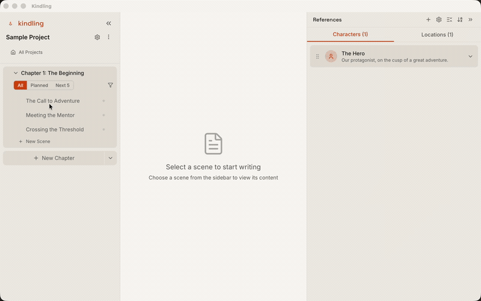

<p align="center">
  
</p>

<h1 align="center">Kindling</h1>

<p align="center">
  <strong>Free, open-source writing software for plotters and outliners.</strong><br/>
  Bridge the gap between your story outline and your first draft.
</p>

<p align="center">
  <a href="https://kindlingwriter.com/">Website</a> ·
  <a href="https://kindlingwriter.com/download/">Download</a> ·
  <a href="https://kindlingwriter.com/features/">Features</a> ·
  <a href="https://kindlingwriter.com/docs/">Docs</a> ·
  <a href="https://kindlingwriter.com/compare/">Compare</a> ·
  <a href="#contributing">Contributing</a>
</p>

<p align="center">
  <a href="https://github.com/smith-and-web/kindling/actions/workflows/ci.yml">
    
  </a>
  <a href="https://github.com/smith-and-web/kindling/releases">
    
  </a>
  <a href="https://github.com/smith-and-web/kindling/blob/main/LICENSE">
    
  </a>
  <a href="https://github.com/smith-and-web/kindling/stargazers">
    
  </a>
  <a href="https://github.com/smith-and-web/kindling/releases">
    
  </a>
  
</p>

---

<p align="center">
  
</p>

> **New in v1.2:** Light theme, full-page prose editing, bidirectional Scrivener import/export, screenplay project type, custom fields & tags, smart reference detection, and story structure templates. [Read the release notes.](https://github.com/smith-and-web/kindling/releases/tag/v1.2.0)

## Why Kindling?

- **Your outline stays visible while you write.** Scene beats appear as expandable prompts in your drafting space. No more switching between apps.
- **Import your existing work.** Bring in projects from Scrivener (.scriv), Plottr (.pltr), yWriter (.yw7), Obsidian Longform, or Markdown — no starting from scratch.
- **No AI. No subscription. No cloud.** Every word is yours. Your projects are local SQLite files. Works completely offline.
- **Free and open source.** MIT licensed. Inspect the code, contribute, or fork it. Your tools should be as permanent as your writing.

## Download

Get Kindling for free at **[kindlingwriter.com/download](https://kindlingwriter.com/download/)**

| Platform | Download |
|----------|----------|
| macOS (Universal) | `Kindling_*_universal.dmg` |
| Windows | `Kindling_*_x64-setup.msi` |
| Linux | `Kindling_*_amd64.AppImage` or `.deb` |

Or grab the latest directly from the [Releases page](https://github.com/smith-and-web/kindling/releases).

## Features

| Feature | Description |
|---------|-------------|
| **Import from popular tools** | Scrivener 3 (`.scriv`), Plottr (`.pltr`), Markdown (`.md`), yWriter (`.yw7`), and Longform/Obsidian |
| **Scaffolded writing view** | Scene beats appear as expandable prompts — or switch to full-page prose editing |
| **Rich text prose editor** | Write with formatting, auto-save, word count, and beat context |
| **Export formats** | Scrivener (`.scriv`), DOCX (Standard Manuscript Format), EPUB, Markdown, Longform/Obsidian, and Treatment (1-page & 5-page) |
| **Screenplay support** | Screenplay project type with sluglines, acts/sequences, and page count estimates |
| **Reference auto-detection** | Characters and locations are auto-detected in your prose — no manual linking needed |
| **Custom fields & tags** | Add typed custom fields (text, number, select, etc.) and hierarchical tags to any entity |
| **Beat sheet templates** | Start from Hero's Journey, Save the Cat, Three-Act Structure, Story Circle, and more |
| **Reference panel** | Characters, locations, items, objectives, and organizations — linked per scene |
| **Sync/reimport** | Preview and apply source changes while preserving your prose |
| **Light & dark themes** | System preference detection with manual override |
| **Local-first** | Your work stays on your machine in a SQLite database |
| **Cross-platform** | macOS, Windows, and Linux |

See the full [features overview](https://kindlingwriter.com/features/) on the website.

## Tech Stack

- **Frontend**: [Svelte 5](https://svelte.dev/) + [Tailwind CSS](https://tailwindcss.com/)
- **Backend**: [Rust](https://www.rust-lang.org/) + [Tauri 2.x](https://tauri.app/)
- **Database**: [SQLite](https://sqlite.org/) via rusqlite
- **Parsers**: Native Rust parsers for Scrivener 3, Plottr, yWriter, Longform, and Markdown

## From Source

**Prerequisites:**
- [Node.js](https://nodejs.org/) 20+
- [Rust](https://rustup.rs/) (stable)
- Platform dependencies: [Tauri prerequisites](https://tauri.app/start/prerequisites/)

```bash
# Clone the repository
git clone https://github.com/smith-and-web/kindling.git
cd kindling

# Install dependencies
npm install

# Run in development mode
npm run tauri dev

# Build for production
npm run tauri build
```

## Roadmap

Track progress on the [project board](https://github.com/users/smith-and-web/projects/1).

| Phase | Status | Description |
|-------|--------|-------------|
| **v0.1 - Foundation** | ✅ Complete | Plottr import, basic UI, project structure |
| **v0.2 - Outline View** | ✅ Complete | Drag-and-drop reordering, create/delete scenes |
| **v0.3 - Writing & Export** | ✅ Complete | Prose editor, DOCX export with Standard Manuscript Format |
| **v1.0 - Release** | ✅ Complete | Additional importers, polish, performance, stability |
| **v1.1 - Plantser Support** | ✅ Complete | Rolling Outline Mode, blank projects, beat management, discovery notes, command palette, guided onboarding, auto-updater |
| **v1.2 - Features** | ✅ Complete | Scrivener import/export, screenplay support, light theme, custom fields, tags, templates, auto-detection, EPUB, treatments |

See the [milestones](https://github.com/smith-and-web/kindling/milestones) for detailed breakdowns.

## Testing

Kindling maintains high test coverage standards to ensure code quality and prevent regressions.

| Metric | Minimum | Current |
|--------|---------|---------|
| Statements | 95% | 100% |
| Branches | 65% | 100% |
| Functions | 98% | 100% |
| Lines | 95% | 100% |

**CI will fail if coverage drops below these thresholds.** New code must include appropriate tests.

```bash
# Frontend tests with coverage
npm test -- --coverage

# Rust tests
cd src-tauri && cargo test

# Run all checks (lint, format, types, tests)
npm run check:all
```

## Previous scene context

The **Previously** section at the top of a scene shows the preceding scene's title,
synopsis, and last three sentences of prose (or all available prose if shorter).
It follows manuscript order across chapters, skips archived scenes and chapters,
and reads the active Beat or Page view. Outline prompts are never used as prose.
The first scene has no Previously section. Collapse it to save space; Kindling
remembers that preference across scenes and app restarts.

## Writing goals and statistics

The sidebar shows saved word counts for the project, chapters and scenes. The editor
status bar shows the current scene, current chapter, project and session totals,
including when the sidebar is collapsed. Choose **Writing statistics** in the status
bar for total words, a chapter breakdown, scenes with prose versus empty scenes, and
average words per scene (including empty scenes). Counts use the active Page or Beat
View prose and exclude archived content and outline prompts.

Set a **Daily writing goal** in **Project Settings** (default: 500 words; 0 turns the
goal off). Daily and session totals measure net words added by saved edits, including
Find and Replace; deleting words reduces these totals, which can be negative.
Imports, duplication, reorganization, draft restoration and accepted editorial suggestions do not earn or remove writing credit. If you restore an earlier draft and write the text again, those new saved edits count as new writing activity.

Daily totals use your computer's local calendar day and persist across app restarts.
Your streak counts consecutive days meeting their goals; an unfinished today keeps
yesterday's streak alive until midnight. Changing a goal applies today and forward,
without changing earlier days' targets. Session totals are per project, since the
app started or you clicked **Reset**. Reset saves pending prose first and preserves
daily totals and streaks.

## Find and replace prose

Use **Edit → Find in Scene** (`Cmd/Ctrl+F`) or **Find and Replace in Project**
(`Cmd/Ctrl+Shift+F`). The command palette also offers Find and
Replace. Choose the current scene or entire project, optionally match case or
whole words, and use Previous/Next (or Enter/Shift+Enter in Find) to review matches.
**Open scene** takes you to the matching scene and expands its beat when applicable.

Enable **Replace** to replace the current match or confirm **Replace all**. An empty
replacement deletes the matched text. **Undo replacement** reverses changes while
the dialog remains open. Formatting outside the matched text is preserved; inserted
text inherits the formatting at the start of the match. Replacing one match advances
past the inserted text and stops at the end; use Next or Previous to wrap around.

Search covers active scene/beat prose in Fixed scenes, including locked scenes.
Flexible, Undefined and archived scenes, outline prompts, synopses, and reference
notes are excluded. Replacements skip locked scenes and chapters, and documents
with unsaved drafts. Pending prose edits are saved before searching; transient
save failures stop loading and can be retried with **Retry loading**.

Drafts rejected because their target was deleted or locked, or because of an
unrecognized error, leave the automatic retry queue, so they do not block search
or mode switching in other scenes. You
can review and copy these retained drafts in Find and Replace, choose **Retry
saving drafts** after unlocking, or explicitly confirm **Discard unsaved drafts**
to reload the saved prose. These drafts remain in memory for the current app
session, including after closing and reopening a project; they are not a backup
across app restarts. Switching between page and beat views waits for pending
prose writes and stops if a retryable save still fails.

## Contributing

Contributions are welcome! Please read the [Contributing Guide](CONTRIBUTING.md) before submitting a PR.

- 🐛 [Report bugs](https://github.com/smith-and-web/kindling/issues/new?template=bug_report.yml)
- 💡 [Request features](https://github.com/smith-and-web/kindling/issues/new?template=feature_request.yml)
- 💬 [GitHub Discussions](https://github.com/smith-and-web/kindling/discussions) — Questions and ideas
- 🔥 [Discord](https://discord.gg/g7bkj4kY8w) — Chat with other writers and contributors

Looking for a place to start? Check out issues labeled [`good first issue`](https://github.com/smith-and-web/kindling/labels/good%20first%20issue).

## Support

If Kindling is useful to you, consider supporting its development:

<a href="https://github.com/sponsors/smith-and-web">
  
</a>

Your sponsorship helps keep Kindling free and open source.

## License

[MIT](LICENSE) — free for personal and commercial use.

## Acknowledgments

- Built with [Tauri](https://tauri.app/) and [Svelte](https://svelte.dev/)
- Inspired by [Scrivener](https://www.literatureandlatte.com/scrivener/) and [Plottr](https://plottr.com/)

---

<p align="center">
  Made with ☕ for writers who plan before they write.
</p>

### Scene revisions and editorial review

Open **Revisions** above a scene to review its prose without changing the manuscript as you annotate it. In **Draft history**, save a named draft (Draft 1, Draft 2, and so on), compare any two saved drafts or a draft with current prose, or restore a draft. Restoring and accepting suggestions automatically preserve the current prose as another draft. Drafts retain page prose, beat prose, and the editing mode; restoring requires the same beat structure. Comparison shows text changes; saved drafts retain formatting. Large, heavily changed scenes may show a single replacement for the changed passage to keep comparison responsive.

In **Editorial review**, select text to add a comment or suggest a replacement/deletion, or place the cursor to propose an insertion. Enter your name to identify comments, reply to threads, and resolve or reopen them. Review insertions underlined in color and deletions struck through. Use **Previous change** / **Next change** to step through suggestions, then accept or reject one or all. Overlapping suggestions must be handled individually. When prose changes outside review, affected annotations are marked outdated: select their intended text and choose **Re-anchor to selection** before accepting them. No suggestion changes prose until accepted. Accepting changes marks the scene Revised. Bulk decisions and navigation cover the active editing mode; annotations on inactive prose remain available when you return to their original mode.

Set a scene’s revision status to **First Draft**, **Editor Review**, **Revised**, or **Final**; **All scenes** shows the project’s statuses and saved-draft counts by chapter. Locked scenes can be read but not changed. Revision history and comments live in the local project database and are included in newly created project snapshots. This initial version supports writers and editors taking turns on the same local project; it does not exchange annotations through manuscript exports or provide simultaneous collaboration.
